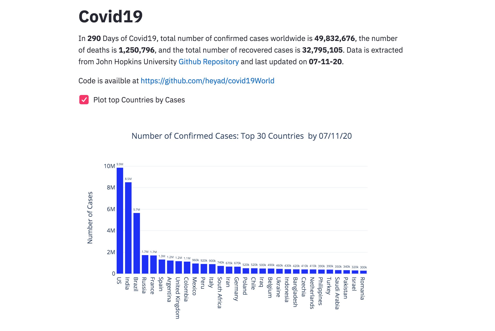
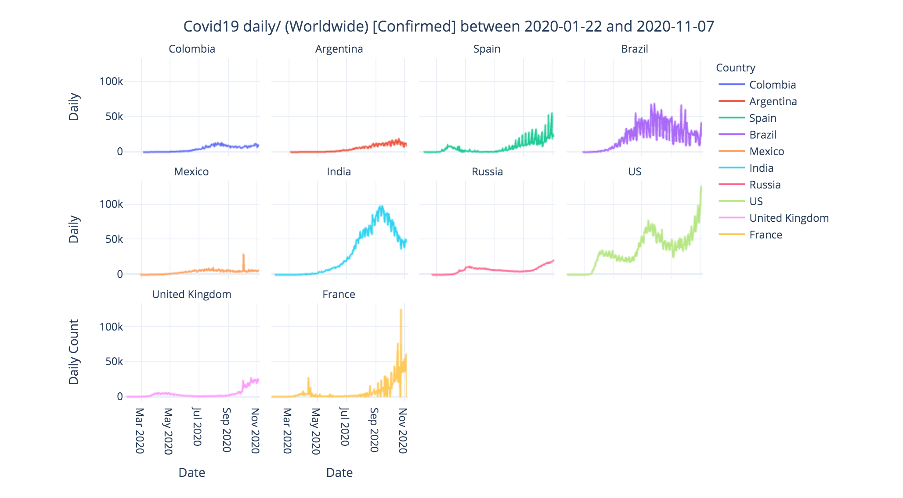
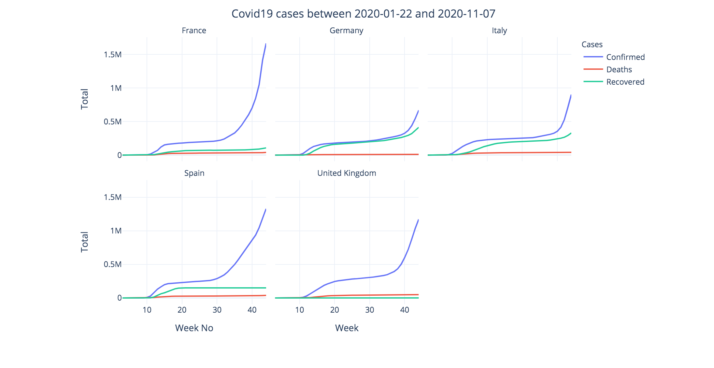
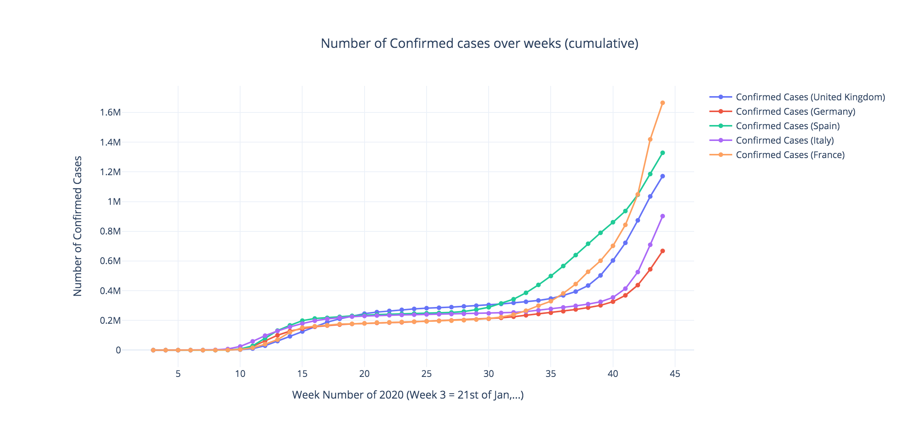

### covid19 (Worldwide) 

* Data is obtained from [John Hopkins University](https://github.com/CSSEGISandData/COVID-19)
* Other [data sources](https://data.humdata.org/dataset?ext_quickcharts=1)
* Crisis related [data] (https://data.humdata.org/)
* A lot more to be done regarding countries population, etc...

The code is simply Python-based and made use of [Streamlit](https://www.streamlit.io/) to build the interactive features. It is an open-source framework, free, Python-based and easy to use tool to build and deploy data-driven and machine learning applications. This repo was started in a nice and sunny weekend in Aberdeen, during the lockdown and when #stayAthome was trending on twitter and elsewhere. 

#### Requirements 


* You need to have Python installed on your machine 
* You need to have streamlit installed, if not, simply issue the following command  

```
$pip install streamlit
```

#### Covid19 (World) / Updated daily

Data is collected on daily basis from [John Hopkins University](https://github.com/CSSEGISandData/COVID-19). The code allows you to see the spread of covid19 across different countries and at different periods of time

. Easiest way to run it is by using this command from your command line:
```
$ streamlit run https://raw.githubusercontent.com/heyad/covid19World/master/covid19.py
```

Alternatively, check the [Code](covid19.py). Download and run the code as follows: 

```
streamlit run covid19.py 
```


If everything is OK,  your browser will open and load the following page (Select different cases i.e. Death, Recovered for more information): 


Use the left hand sidebar to explore the data further (daily spread for one ore more countries, compare countries, show spread of death/ confirmed cases, ... and so on). Below is an example of the daily spread of confirmed cases across the top 8 countries in the world. (Change date, number of top countries, to see results)


You can also show different countries of your choice in one plot and explore number of confirmed cases, deaths, and recovered case. To do so, select `Total Numbers` from the side bar, followed by selecting one more more countries. Change date, for more options 



You can explore different other optoins, for example compare selected contries in terms of death/confirmed cases between certain date. To do so, select `Compare Countries Numbers` from sidebar, and chose one ore more countries (change the dates, or cases accordingly). 



#### To do  

* Data type checking, exceptions handling, and testing 
* Add more data i.e. start of lock down in each country, countries populations, etc...
* More in-depth analysis of the data i.e. time-series, trends, etc...
* Compare data of one country to others 


#### Comments / Questions 

You can reach me at [my staff page](https://www3.rgu.ac.uk/dmstaff/elyan-eyad) or on [linkedin](http://www.linkedin.com/in/elyan )

